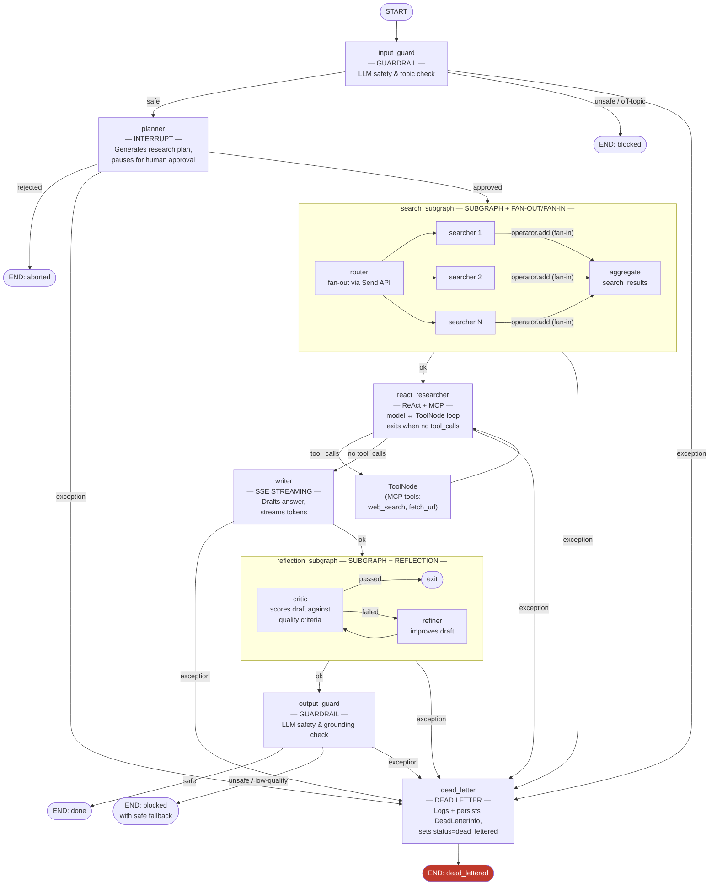

# Plan: agent-app — LangGraph + FastAPI + Postgres Reference Implementation

## Context

`agent-lib` already has a skeleton with Postgres checkpointing and time-travel tests. The goal is to create `agent-app/` as a best-practice, educational FastAPI service that sits alongside `churn-app/` and shows the full LangGraph feature set: time-travel, interrupts, async nodes, subgraphs, and SSE token streaming. LiteLLM + Ollama is the default LLM backend. The project informs structural patterns only (node factories, interrupt/resume flow, eval framework shape) — all business logic is original.

**Quality bar**: Production-grade code (type hints everywhere, async-first, structured logging via the custom `logger` package (`get_logger(__name__)` + `configure_logging()` called once in lifespan — never stdlib `logging`), proper error hierarchy, Pydantic validation at boundaries) with deliberately simple business logic — the research assistant domain is a vehicle to demonstrate LangGraph features cleanly.

**The agent**: A **research assistant** that validates input, plans a research task, pauses for human approval, fans out parallel searches, runs a ReAct tool loop to gather context, drafts an answer, refines it via Reflection, then validates output before returning — each node exists to showcase exactly one LangGraph/agentic capability.

---

## Patterns Demonstrated

Each node in the graph demonstrates exactly one pattern:

| Pattern | Where demonstrated | Key mechanism |
|---|---|---|
| **Subgraph** | `search_subgraph`, `reflection_subgraph` | Compiled `StateGraph` added as a single node |
| **Fan-out / Fan-in** | Inside `search_subgraph` | `Send` API spawns parallel searchers; `operator.add` reducer collects results |
| **ReAct (non-deterministic steps)** | `react_researcher` node | Model ↔ `ToolNode` loop; `tools_condition` edge exits when model emits no `tool_calls` |
| **Reflection** | `reflection_subgraph` | Draft → Critic → Refiner → Critic loop until quality criteria met |
| **MCP** | `react_researcher` (consumes) + `app/mcp/server.py` (serves) | `fastmcp` server exposes search/fetch tools; LangGraph agent binds them via `langchain-mcp-adapters` |
| **Guardrails** | `input_guard` (pre-planner), `output_guard` (pre-END) | LLM-based safety/relevance check; routes to `END` with error on failure |
| **Dead Letter** | `dead_letter` terminal node + `with_dead_letter` decorator | Any unhandled exception in any node writes `DeadLetterInfo` to state and routes to `dead_letter` instead of crashing |

---

## Target Layout

```
agent-app/
├── pyproject.toml
├── README.md
├── PLAN.md
├── langgraph.json
├── evals/
│   ├── run_experiment.py
│   ├── create_dataset.py
│   ├── configs/
│   │   ├── exp_baseline.yaml
│   │   └── scoring_rubric.yaml    # LLM quality criteria + deterministic trace assertions
│   └── datasets/
│       └── sample.yaml            # 5 synthetic prospect profiles
├── tests/
└── app/
    ├── __init__.py
    ├── __main__.py            # uv run python -m app
    ├── main.py                # FastAPI factory + lifespan
    ├── config.py              # Pydantic BaseSettings (AGENT_ prefix)
    ├── models.py              # Request/response schemas
    ├── dependencies.py        # get_graph() FastAPI dependency
    ├── exceptions.py          # LLMError hierarchy
    ├── routers.py             # /v1/chat, /v1/chat/stream, /v1/threads/{id}/history, /v1/threads/{id}/replay
    ├── mcp/
    │   ├── __init__.py
    │   ├── __main__.py        # uv run python -m app.mcp → uvicorn app.mcp.server:mcp
    │   └── server.py          # fastmcp server exposing web_search + fetch_url tools
    └── graph/
        ├── __init__.py
        ├── state.py           # AgentState TypedDict
        ├── workflow.py        # Graph + checkpointer assembly
        ├── mcp_client.py      # fastmcp client factory; binds MCP tools for LangGraph
        └── nodes/
            ├── __init__.py
            ├── _llm_invoke.py         # Centralised async LLM wrapper + error translation + build_llm() factory
            ├── _dead_letter.py        # DeadLetterInfo TypedDict + with_dead_letter decorator + dead_letter_node
            ├── input_guard.py         # GUARDRAIL: blocks off-topic / unsafe input
            ├── planner.py             # Plans steps; interrupt() for human approval
            ├── react_researcher.py    # ReAct: model ↔ ToolNode loop (MCP tools)
            ├── writer.py              # Drafts final answer; streams tokens
            ├── output_guard.py        # GUARDRAIL: validates answer before returning
            └── subgraphs/
                ├── search.py          # SUBGRAPH + FAN-OUT/FAN-IN: parallel searchers via Send
                └── reflection.py      # SUBGRAPH + REFLECTION: critic/refiner loop
```

---

## Graph Design



**State (`AgentState`)**:
```python
class AgentState(TypedDict):
    messages: Annotated[list[AnyMessage], operator.add]
    plan: list[str]                # Planner output
    plan_approved: bool
    search_results: list[str]      # written once by search_subgraph; fan-in is internal to the subgraph
    react_steps: int               # incremented each ReAct iteration (observability only)
    draft_answer: str              # writer output before reflection
    reflection_attempts: int       # reflection loop counter
    reflection_passed: bool
    final_answer: str              # output_guard-approved answer
    status: str                    # "planning"|"searching"|"researching"|"writing"|"reflecting"|"done"|"aborted"|"blocked"|"dead_lettered"
    guard_reason: str | None       # set when input_guard or output_guard blocks
    dead_letter: DeadLetterInfo | None  # set by with_dead_letter decorator on any unhandled exception
```

**Key patterns**:
- All nodes: `async def node(state: AgentState, config: RunnableConfig) -> dict`
- Factory pattern: `make_planner_node(llm)` returns the async function
- Interrupt: `planner` calls `interrupt({"plan": plan_text})`, resumed with `Command(resume=True/False)`
- Subgraphs: `search_subgraph` and `reflection_subgraph` are compiled `StateGraph` instances added via `graph.add_node("search", search_subgraph)`
- Token streaming: `graph.astream_events(input, config, version="v2")` filtered to `on_chat_model_stream`
- All LangGraph invocations are async: `await graph.ainvoke(...)`, `await graph.aget_state(...)`, `await graph.aupdate_state(...)`
- `snapshot.next` is `tuple[str, ...]` (not a list) — use `bool(snapshot.next)` to test if graph is interrupted
- Subgraphs with **disjoint state keys** cannot be added directly via `add_node(name, compiled_sub)`. A wrapper function that maps parent keys → subgraph input and back is required; there is no `input_schema`/`output_schema` shortcut

---

## Pattern Deep-Dives

### Fan-out / Fan-in (inside `search_subgraph`)

`search_subgraph` receives `plan` and fans out one searcher per plan step using the `Send` API.
The `operator.add` reducer lives on `SearchState.results` *inside the subgraph* — the parallel
`Send` branches each write one result and LangGraph merges them via the reducer before the
subgraph exits. The parent `AgentState.search_results` is a plain `list[str]` written once
when the subgraph returns.

```python
# subgraphs/search.py
class SearchState(TypedDict):
    queries: list[str]
    results: Annotated[list[str], operator.add]  # fan-in target — internal to subgraph

def route_to_searchers(state: SearchState) -> list[Send]:
    return [Send("searcher", {"queries": [], "results": [], "query": q})
            for q in state["queries"]]

async def searcher_node(state: SearchState, config: RunnableConfig) -> dict:
    result = await _run_search(state["query"], config)   # MCP web_search or DuckDuckGo
    return {"results": [result]}

search_graph = StateGraph(SearchState)
search_graph.add_node("router", lambda s: s)
search_graph.add_node("searcher", searcher_node)
search_graph.add_conditional_edges("router", route_to_searchers)
search_graph.add_edge("searcher", END)
search_subgraph = search_graph.compile()
# Parent graph receives: {"search_results": state["results"]} from the subgraph output mapper
```

### ReAct — Non-deterministic Steps (in `react_researcher`)

`react_researcher` is a single node wired with a `ToolNode` in an open loop.
The model decides when it has gathered enough context. A hard ceiling of `MAX_REACT_STEPS` (default 10, configurable via `AGENT_MAX_REACT_STEPS`) exits the loop even if the model keeps emitting `tool_calls` — the writer runs with whatever context was gathered.

MCP tools are loaded **once** in `lifespan()` before the graph is compiled, then injected
into both the node closure and `ToolNode`. This keeps the MCP connection alive for the
entire lifetime of the app and avoids reopening it on every node invocation.

```python
# nodes/react_researcher.py
def make_react_researcher_node(llm_with_tools: BaseChatModel) -> Callable:
    async def react_researcher(state: AgentState, config: RunnableConfig) -> dict:
        response = await llm_with_tools.ainvoke(state["messages"], config)
        return {"messages": [response], "react_steps": state["react_steps"] + 1}
    return react_researcher

# workflow.py — tools loaded before compile; condition routes to "writer" not END
def compile_graph(
    checkpointer: AsyncPostgresSaver,
    llm: BaseChatModel,
    mcp_tools: list[BaseTool],
) -> CompiledStateGraph:
    llm_with_tools = llm.bind_tools(mcp_tools)

    graph = StateGraph(AgentState)
    graph.add_node("react_researcher", make_react_researcher_node(llm_with_tools))
    graph.add_node("tools", ToolNode(mcp_tools))

    # Cannot use the built-in tools_condition here: it returns "__end__" (not "writer")
    # when there are no tool_calls.  A custom condition is required.
    # Also enforces the MAX_REACT_STEPS ceiling to prevent runaway tool loops.
    def react_condition(state: AgentState) -> Literal["tools", "writer"]:
        last = state["messages"][-1]
        ceiling_hit = state["react_steps"] >= settings.max_react_steps
        return "tools" if getattr(last, "tool_calls", None) and not ceiling_hit else "writer"

    graph.add_conditional_edges("react_researcher", react_condition)
    graph.add_edge("tools", "react_researcher")
    ...
    return graph.compile(checkpointer=checkpointer)

# main.py lifespan — tools loaded once at startup; client has no async context manager
async def lifespan(app: FastAPI) -> AsyncGenerator[None, None]:
    mcp_tools = await load_mcp_tools(settings.mcp_server_url)   # await — get_tools() is async
    async with AsyncPostgresSaver.from_conn_string(settings.db_uri) as checkpointer:
        await checkpointer.setup()
        app.state.graph = compile_graph(checkpointer, build_llm(), mcp_tools)
        yield
```

### Reflection (inside `reflection_subgraph`)

The subgraph loops: `critic` scores the draft answer against criteria (relevance, completeness, grounding); if it fails, `refiner` improves the draft and the critic re-evaluates. The loop exits on quality pass **or when `reflection_attempts` reaches `MAX_REFLECTION_ATTEMPTS`** (default 5, configurable via `AGENT_MAX_REFLECTION_ATTEMPTS`). On ceiling hit the best draft is kept and `reflection_passed` is set to `False` — the output guard still runs.

`ReflectionState` uses short internal keys (`draft`, `passed`) that differ from `AgentState`
(`draft_answer`, `reflection_passed`). Because LangGraph only auto-merges **matching** keys,
a wrapper node is required — there is no `input_schema`/`output_schema` shortcut.

```python
# subgraphs/reflection.py — internal state
class ReflectionState(TypedDict):
    draft: str
    critique: str
    reflection_attempts: int
    passed: bool

MAX_REFLECTION_ATTEMPTS = settings.max_reflection_attempts  # default 5

def should_refine(state: ReflectionState) -> Literal["refiner", END]:
    ceiling_hit = state["reflection_attempts"] >= MAX_REFLECTION_ATTEMPTS
    return END if state["passed"] or ceiling_hit else "refiner"

reflection_subgraph = reflection_graph.compile()

# workflow.py — wrapper maps parent keys ↔ subgraph keys
async def run_reflection(state: AgentState, config: RunnableConfig) -> dict:
    result = await reflection_subgraph.ainvoke(
        {
            "draft": state["draft_answer"],
            "critique": "",
            "reflection_attempts": state["reflection_attempts"],
            "passed": False,
        },
        config,
    )
    return {
        "final_answer": result["draft"],
        "reflection_passed": result["passed"],
        "reflection_attempts": result["reflection_attempts"],
    }

parent_graph.add_node("reflection_subgraph", run_reflection)
```

### MCP — `fastmcp` Server + LangGraph Binding

A tiny `fastmcp` server (`app/mcp/server.py`) exposes two tools: `web_search` and `fetch_url`.
The server can be started standalone (`uv run python -m app.mcp.server`) or in-process for tests.
`mcp_client.py` connects and returns a list of `BaseTool` compatible objects that `react_researcher` binds.

```python
# app/mcp/server.py
from fastmcp import FastMCP

mcp = FastMCP("research-tools")

@mcp.tool()
async def web_search(query: str) -> str:
    """Search the web and return a summary of results."""
    ...

@mcp.tool()
async def fetch_url(url: str) -> str:
    """Fetch the text content of a URL."""
    ...
```

```python
# app/graph/mcp_client.py
from langchain_mcp_adapters.client import MultiServerMCPClient
from langchain_core.tools import BaseTool

async def load_mcp_tools(server_url: str) -> list[BaseTool]:
    # MultiServerMCPClient does NOT support async context manager (__aenter__ raises
    # NotImplementedError as of 0.1.x).  Instantiate directly and await get_tools().
    client = MultiServerMCPClient(
        {"research": {"url": server_url, "transport": "streamable_http"}}
    )
    return await client.get_tools()   # get_tools() is async — must be awaited
```

### Dead Letter State

Any unhandled exception in any node is caught by the `with_dead_letter` decorator, which writes
a `DeadLetterInfo` record to state and sets `status="dead_lettered"`. A shared routing helper
checks this field after every node; if set, the graph routes to the terminal `dead_letter` node
instead of the next planned node.

This is analogous to a DLQ in messaging: the execution doesn't crash or disappear — it lands in
an observable, structured record that can be inspected via the checkpoint history or replayed
from that point.

```python
# nodes/_dead_letter.py

class DeadLetterInfo(TypedDict):
    failed_node: str
    error_type: str
    error_message: str
    traceback: str
    timestamp: str   # ISO-8601

def with_dead_letter(node_name: str) -> Callable:
    """Decorator for any node that performs LLM or I/O work."""
    def decorator(fn: Callable) -> Callable:
        async def wrapper(state: AgentState, config: RunnableConfig) -> dict:
            try:
                return await fn(state, config)
            except Exception as exc:
                return {
                    "dead_letter": DeadLetterInfo(
                        failed_node=node_name,
                        error_type=type(exc).__name__,
                        error_message=str(exc),
                        traceback=traceback.format_exc(),
                        timestamp=datetime.utcnow().isoformat(),
                    ),
                    "status": "dead_lettered",
                }
        return wrapper
    return decorator

async def dead_letter_node(state: AgentState, config: RunnableConfig) -> dict:
    """Terminal node: structured-log the DeadLetterInfo and return."""
    logger.error("dead_letter", extra={"dead_letter": state["dead_letter"]})
    # Checkpointer persists state automatically — record is replayable via time-travel.
    return {}

# workflow.py — shared router inserted after every node that can fail
def after(next_node: str) -> Callable[[AgentState], str]:
    def _route(state: AgentState) -> str:
        return "dead_letter" if state.get("dead_letter") else next_node
    return _route

# Usage on each edge:
graph.add_conditional_edges("planner", after("search_subgraph"))
graph.add_conditional_edges("search_subgraph", after("react_researcher"))
# … etc.
```

Nodes decorated with `@with_dead_letter("node_name")`: `input_guard`, `planner`,
`react_researcher` (and its `ToolNode` wrapper), `writer`, `output_guard`.
The two subgraphs (`search_subgraph`, `reflection_subgraph`) are wrapped at the parent level
via the `after()` routing helper so internal subgraph exceptions still route to `dead_letter`.

### Circuit Breakers & Loop Guards

Four independent safeguards prevent runaway execution and uncontrolled cost growth.
All limits are configurable via `AGENT_` env vars; defaults are conservative.

#### 1 — Reflection ceiling (`AGENT_MAX_REFLECTION_ATTEMPTS`, default `5`)

`should_refine` in `reflection_subgraph` exits when `reflection_attempts >= max_reflection_attempts`
even if the critic has not passed. The writer's best draft is kept; `reflection_passed=False` propagates
to the parent and the output guard still runs.

#### 2 — ReAct ceiling (`AGENT_MAX_REACT_STEPS`, default `10`)

`react_condition` in `workflow.py` routes to `"writer"` when `react_steps >= max_react_steps`,
regardless of whether the model emitted `tool_calls`. The writer runs with whatever context was
gathered — no tool results are lost.

#### 3 — LLM call timeout (`AGENT_LLM_TIMEOUT_SECONDS`, default `60`)

`_llm_invoke.py` wraps every `llm.ainvoke` / `llm.astream` call in `asyncio.wait_for` with
`timeout=settings.llm_timeout_seconds`. On expiry, `asyncio.TimeoutError` is caught and
re-raised as `LLMServiceUnavailableError` so the dead-letter decorator picks it up.

```python
# nodes/_llm_invoke.py
async def llm_invoke(llm: BaseChatModel, messages: list[AnyMessage], config: RunnableConfig) -> AnyMessage:
    try:
        return await asyncio.wait_for(
            llm.ainvoke(messages, config),
            timeout=settings.llm_timeout_seconds,
        )
    except asyncio.TimeoutError:
        raise LLMServiceUnavailableError("LLM call timed out")
    except Exception as exc:
        raise _translate(exc)
```

#### 4 — Global pipeline step cap (`AGENT_MAX_PIPELINE_STEPS`, default `50`)

LangGraph enforces `recursion_limit` as a hard ceiling on **supersteps** (one node execution = one superstep) per invocation. It is injected on every `ainvoke` / `astream_events` call in `routers.py`:

```python
config: RunnableConfig = {
    "configurable": {"thread_id": ...},
    "recursion_limit": settings.max_pipeline_steps,
}
```

This is defense-in-depth on top of the per-loop ceilings. Worst-case superstep count for a normal run:
`react(10) + reflection(5 × 2 nodes) + ~6 other nodes = ~26`. Default of `50` is generous for normal runs while bounding any routing bug that produces an unexpected loop. LangGraph raises `GraphRecursionError` when the limit is hit.

#### 5 — Retry with exponential backoff (`AGENT_LLM_MAX_RETRIES`, default `3`)

`_llm_invoke.py` retries on transient errors (`LLMRateLimitError`, `LLMServiceUnavailableError`)
with exponential backoff (base `1s`, max `30s`). Non-retryable errors (`LLMError` base class)
are re-raised immediately.

```python
# nodes/_llm_invoke.py
async def llm_invoke_with_retry(llm: BaseChatModel, messages: list[AnyMessage], config: RunnableConfig) -> AnyMessage:
    last_exc: Exception | None = None
    for attempt in range(settings.llm_max_retries + 1):
        try:
            return await llm_invoke(llm, messages, config)
        except (LLMRateLimitError, LLMServiceUnavailableError) as exc:
            last_exc = exc
            wait = min(2 ** attempt, 30)
            await asyncio.sleep(wait)
        except LLMError:
            raise
    raise last_exc  # type: ignore[misc]
```

All four limits are also exposed to the eval runner so experiments can be reproduced with
different ceilings without redeploying.

---

### Guardrails — Input and Output

**Input guard** (`input_guard.py`): first node after `START`. Asks the LLM to classify the user's request as `safe` or `unsafe` against a system prompt that describes allowed topics. Routes to `END` immediately (sets `status="blocked"`, `guard_reason=...`) on failure — the planner never runs.

**Output guard** (`output_guard.py`): last node before `END`. Checks the `final_answer` for factual grounding in `search_results` and absence of harmful content. On failure: sets `status="blocked"` and replaces `final_answer` with a safe fallback message rather than routing through refiner again (keeps the graph acyclic beyond reflection).

Both guards use a small, structured LLM call that returns `{"verdict": "safe"|"unsafe", "reason": "..."}` parsed with Pydantic.

---

## LLM Client (LiteLLM + Unsloth / llama.cpp)

`build_llm()` lives in `nodes/_llm_invoke.py` alongside the retry/timeout wrappers so all LLM concerns are co-located.

```python
# nodes/_llm_invoke.py
from langchain_community.chat_models import ChatLiteLLM

def build_llm() -> ChatLiteLLM:
    # Qwen3 thinking mode: enable_thinking must go through model_kwargs so
    # LiteLLM forwards it to the llama.cpp/Unsloth server.  ChatLiteLLM's own
    # `thinking=` kwarg is Anthropic-specific and has no effect here.
    return ChatLiteLLM(
        model=settings.llm_model,
        api_base=settings.llm_base_url,
        api_key=settings.llm_api_key,
        model_kwargs={"enable_thinking": settings.llm_thinking},
    )
```

Config: `AGENT_LLM_MODEL` (default `openai/unsloth/Qwen3.6-35B-A3B-UD-MLX-4bit`), `AGENT_LLM_BASE_URL` (default `http://127.0.0.1:8888/v1`), `AGENT_LLM_THINKING` (default `false`), `AGENT_LLM_TIMEOUT_SECONDS` (default `60`), `AGENT_LLM_MAX_RETRIES` (default `3`), `AGENT_MAX_REFLECTION_ATTEMPTS` (default `5`), `AGENT_MAX_REACT_STEPS` (default `10`).

Default model is [Unsloth Qwen3.6](https://unsloth.ai/docs/models/qwen3.6): MLX 4-bit variant running via Unsloth Studio on Apple Silicon. The `openai/` prefix tells LiteLLM to use the OpenAI-compatible endpoint.

---

## Postgres Checkpointer

```python
# graph/workflow.py
from langgraph.checkpoint.postgres.aio import AsyncPostgresSaver

async def create_checkpointer(db_uri: str) -> AsyncPostgresSaver:
    checkpointer = AsyncPostgresSaver.from_conn_string(db_uri)
    await checkpointer.setup()
    return checkpointer
```

Managed in `lifespan()` via `async with` — same pattern as `churn-app`.

---

## MCP Server Startup

The MCP server runs as a separate process (or in-process for tests):

```bash
# standalone
uv run python -m app.mcp.server          # serves on http://localhost:8001

# or via taskipy
uv run task mcp
```

Config: `AGENT_MCP_SERVER_URL` (default `http://localhost:8001`).

---

## Key API Endpoints

| Method | Path | Feature demonstrated |
|--------|------|---------------------|
| `POST` | `/v1/chat` | Full invoke; handles first turn and interrupt resume |
| `POST` | `/v1/chat/stream` | SSE token stream via `astream_events` |
| `GET` | `/v1/threads/{thread_id}/history` | Full checkpoint list (time-travel) |
| `POST` | `/v1/threads/{thread_id}/replay` | Re-invoke from a named checkpoint |
| `GET` | `/health` | Liveness |

---

## Phases

### Phase 1 — Scaffold + Postgres + Basic Graph + Time-Travel

**Deliverables**:
- `agent-app/pyproject.toml` with all dependencies (see below)
- `config.py` — Pydantic BaseSettings, `AGENT_` prefix
- `main.py` — lifespan: creates `AsyncPostgresSaver`, compiles graph, stores on `app.state`
- `graph/state.py` + `graph/workflow.py` — minimal 2-node graph (planner → writer, no interrupt/subgraph yet)
- `routers.py` — `POST /v1/chat` (invoke only), `GET /health`
- `GET /v1/threads/{thread_id}/history` — returns checkpoint list
- `POST /v1/threads/{thread_id}/replay` — re-invokes from checkpoint
- `README.md` — full local setup guide (see README sections below)

**Tests**:
- `tests/conftest.py` — session-scoped `async_checkpointer` fixture; skips if Postgres unavailable
- `tests/graph/test_checkpointing.py` — accumulation, count, cross-recompile persistence
- `tests/graph/test_time_travel.py` — replay, fork, fork isolation
- `tests/test_models.py` — Pydantic validation (blank message, missing thread_id)

**Done when**: `uv run pytest` passes; `curl http://localhost:8000/health` → 200.

---

### Phase 2 — Interrupts + Subgraphs + Fan-out/Fan-in + ReAct + MCP + Guardrails + Reflection

**Deliverables**:
- `nodes/_dead_letter.py` — `DeadLetterInfo` TypedDict, `with_dead_letter(node_name)` decorator, `dead_letter_node`, `after(next_node)` routing helper
- `nodes/input_guard.py` — LLM-based input guardrail; routes to END on block
- `nodes/planner.py` — async node with `interrupt({"plan": ...})`; resume via `Command(resume=True/False)`; reject → status="aborted"
- `nodes/subgraphs/search.py` — async subgraph; `Send` API fans out one searcher per plan step; `operator.add` reducer fans in results
- `nodes/react_researcher.py` — ReAct loop: `llm.bind_tools(mcp_tools)` + `ToolNode`; exits via `tools_condition` when model stops calling tools
- `nodes/writer.py` — async node; drafts `draft_answer` from accumulated context
- `nodes/subgraphs/reflection.py` — async subgraph; critic → refiner loop until quality criteria met; no hard cap
- `nodes/output_guard.py` — LLM-based output guardrail; replaces answer with safe fallback on failure
- `mcp/server.py` — `fastmcp` server with `web_search` + `fetch_url` tools
- `graph/mcp_client.py` — `MultiServerMCPClient` factory returning `BaseTool`-compatible list
- `exceptions.py` — `LLMError`, `LLMRateLimitError`, `LLMServiceUnavailableError`, `LLMServiceError`
- `graph/nodes/_llm_invoke.py` — centralized async LLM wrapper with error translation
- Full graph wired in `workflow.py`
- Resume logic in `routers.py`: `aget_state()` → check `snapshot.next` → `Command(resume=...)` vs fresh invoke
- `models.py` — `ChatRequest`, `ChatResponse` with `is_interrupted: bool`, `interrupt_value: dict | None`, `guard_reason: str | None`
- `langgraph.json` — LangGraph Studio config

**Tests**:
- `tests/graph/nodes/test_dead_letter.py` — decorator catches exception and populates `DeadLetterInfo`; `after()` routes to `dead_letter` when field is set; clean state routes to next node
- `tests/graph/nodes/test_input_guard.py` — blocks off-topic, passes valid research query
- `tests/graph/nodes/test_planner.py` — emits interrupt, resumes on approve, aborts on reject
- `tests/graph/nodes/subgraphs/test_search.py` — fan-out creates N searcher invocations, results accumulated
- `tests/graph/nodes/test_react_researcher.py` — loop runs N tool steps then exits; empty tool list exits immediately
- `tests/graph/nodes/subgraphs/test_reflection.py` — passes on first attempt, refines on fail, exits without hard cap
- `tests/graph/nodes/test_output_guard.py` — blocks harmful output, passes clean answer
- `tests/graph/nodes/test_llm_invoke.py` — rate limit, connection error, 5xx, 4xx → correct exception type
- `tests/test_exception_handlers.py` — 429, 503, 500 HTTP status codes
- `tests/graph/nodes/test_node_config.py` — `config["configurable"]["node_llms"]["planner"]` overrides LLM
- `tests/mcp/test_server.py` — `web_search` and `fetch_url` tools return strings, MCP schema is valid

**Done when**: Full multi-turn interrupt/resume conversation works end-to-end via curl; MCP server starts standalone.

---

### Phase 3 — Token Streaming (SSE)

**Deliverables**:
- `POST /v1/chat/stream` — `StreamingResponse` with `text/event-stream`
- Filter `astream_events(version="v2")` for `on_chat_model_stream` → `event: token`
- Interrupt mid-stream → `event: interrupt` frame with `interrupt_value`
- `LLMError` → `event: error` frame with status code
- Client disconnect guard via `request.is_disconnected`

**Tests**:
- `tests/test_routers.py` — token frames, interrupt frame, done frame, error frame on LLM failure

**Done when**: `curl -N -X POST /v1/chat/stream` produces token-by-token SSE output.

---

### Phase 4 — Evals (Langfuse + local HTTP runner)

#### Eval dataset and rubric (defined upfront, used from Phase 2 onward)

`evals/datasets/sample.yaml` and `evals/configs/scoring_rubric.yaml` are written before
Phase 1 implementation starts. They define what "correct" looks like and are referenced
directly by the Reflection subgraph's critic prompt and by the Phase 2 node unit tests.

**`evals/datasets/sample.yaml`** — 5 synthetic prospect profiles, each with:
- `input.messages` — the user conversation turns
- `input.approve_plan` — simulated human approval decision
- `expected_output.must_address` — pain point IDs the proposal must cover
- `expected_output.must_reference` — stack items that must appear
- `expected_output.must_include_terms` — domain terms signalling a non-generic response
- `expected_output.must_not_contain` — strings that indicate a templated / off-topic response
- `expected_output.scoring_hints` — free-text guidance for the LLM judge

**`evals/configs/scoring_rubric.yaml`** — two evaluation layers:

| Layer | What it checks | Who runs it |
|---|---|---|
| `quality_criteria` | LLM-judge scores (stack alignment, pain point coverage, specificity, feasibility, risk acknowledgment) | Reflection critic subgraph + eval runner |
| `trace_assertions` | Deterministic checks on checkpoint history and final state (node fired, tool called, field non-empty, status value) | `run_experiment.py` + node unit tests |

Quality criteria use a 0–max integer score per criterion; proposal passes when `total >= 10/13`
AND every per-criterion minimum is met.
Trace assertions never call an LLM — failures indicate a wiring bug, not a quality problem.
Assertions are organised per-node so each node can be tested in isolation.

#### Phase 4 deliverables

- `evals/configs/exp_baseline.yaml` — experiment config (base_url, dataset path, variants with different Ollama models)
- `evals/create_dataset.py` — uploads `sample.yaml` to Langfuse dataset
- `evals/run_experiment.py` — async httpx runner:
  - iterates dataset × model variants
  - calls `POST /v1/chat` per turn (with simulated resume for approval step)
  - runs `trace_assertions` deterministically against returned checkpoint history
  - calls LLM judge with `quality_criteria` rubric to score `final_answer`
  - uploads traces + scores to Langfuse
  - writes `evals/.runs/<timestamp>.json`
- Evaluators (each returns a `langfuse.Score`):
  - `quality_score_evaluator` — runs LLM judge against `quality_criteria`
  - `trace_assertion_evaluator` — runs deterministic `trace_assertions` checks
  - `turns_to_complete_evaluator` — counts turns to reach `status="done"`
  - `plan_approved_evaluator` — verifies interrupt fired and approval was recorded
- Langfuse `CallbackHandler` injected into node `config["callbacks"]`

**Tests**:
- `tests/evals/test_evaluators.py` — quality scores within valid range; aborted run scores 0; trace assertions catch injected state bugs
- `tests/evals/test_trace_assertions.py` — each `trace_assertion` passes on a valid fixture and fails on a deliberately broken one

**Done when**: `uv run task experiment` runs against a live server; both quality scores and trace assertion results appear in Langfuse at `http://localhost:3000`.

---

## Dependencies

```toml
dependencies = [
    "fastapi>=0.115",
    "uvicorn[standard]>=0.34",
    "pydantic-settings>=2.9",
    "litellm>=1.70",
    "langchain-community>=0.3",
    "langchain-core>=0.3",
    "langgraph>=1.2",                          # 1.x required: interrupt(), Command, Send, astream_events v2
    "langgraph-checkpoint-postgres>=3.1",
    "psycopg[binary,pool]>=3.3",               # pool extra needed for AsyncConnectionPool
    "duckduckgo-search>=8.0",
    "httpx>=0.28",
    "langfuse>=3.0",
    "pyyaml>=6.0",
    "fastmcp>=2.0",
    "langchain-mcp-adapters>=0.1.3",           # pin patch: <0.1.3 has breaking tool schema bug
    "logger",                                  # custom structlog wrapper: get_logger() + configure_logging()
]
```

---

## README.md Guide Sections

Full local dev setup in order:

1. **Prerequisites** — Docker, Python 3.13, uv, Ollama

2. **LLM inference server** (llama.cpp or Unsloth Studio):

   **Option A — Unsloth Studio** (recommended; GUI, easier model management):
   ```bash
   pip install unsloth-studio
   unsloth studio -H 127.0.0.1 -p 8888
   ```
   Then open **http://127.0.0.1:8888** in your browser. Search for
   `unsloth/Qwen3.6-35B-A3B-MTP-GGUF`, select the `UD-Q4_K_XL` quant, download it,
   then click **Start**. Studio starts a llama.cpp server in the background and shows
   the API port in the UI — note that port and set `AGENT_LLM_BASE_URL=http://127.0.0.1:<port>/v1`.

   **Option B — llama.cpp server** (headless):
   ```bash
   # download model
   hf download unsloth/Qwen3.6-35B-A3B-MTP-GGUF --include "*UD-Q4_K_XL*"
   # start server on port 8001 (alias must match AGENT_LLM_MODEL)
   ./llama.cpp/llama-server \
     --model unsloth/Qwen3.6-35B-A3B-MTP-GGUF/Qwen3.6-35B-A3B-UD-Q4_K_XL.gguf \
     --alias "unsloth/Qwen3.6-35B-A3B-UD-Q4_K_XL.gguf" \
     --spec-type draft-mtp --spec-draft-n-max 2 \
     --ctx-size 16384 --port 8002
   ```
   OpenAI-compatible API available at `http://127.0.0.1:8002/v1` — set `AGENT_LLM_BASE_URL=http://127.0.0.1:8002/v1` if using this option instead of Studio.
   Port 8001 is reserved for the MCP server (`AGENT_MCP_SERVER_URL` default).

3. **Postgres**:
   ```bash
   docker run --name langgraph-db \
     -e POSTGRES_PASSWORD=postgres \
     -e POSTGRES_DB=langgraph \
     -e POSTGRES_USER=postgres \
     -p 5433:5432 \
     -d postgres:17
   ```

4. **Langfuse** (local Docker):
   ```bash
   git clone https://github.com/langfuse/langfuse.git
   cd langfuse
   docker compose up -d
   # UI: http://localhost:3000
   # Default login: admin@langfuse.com / password
   # Create a project → copy keys to .env
   ```

5. **MCP server** (in a separate terminal):
   ```bash
   cd agent-app
   uv run python -m app.mcp.server   # serves on http://localhost:8001
   ```

6. **App**:
   ```bash
   cd agent-app
   cp .env.example .env   # fill LANGFUSE_PUBLIC_KEY, LANGFUSE_SECRET_KEY
   uv sync
   uv run python -m app
   ```

7. **LangGraph Studio** (free Mac desktop app):
   ```
   Download from https://studio.langchain.com
   Open agent-app/ — Studio reads langgraph.json and starts a dev server
   ```

8. **Evals**:
   ```bash
   uv run task create-dataset
   uv run task experiment
   # Results: evals/.runs/ and Langfuse UI
   ```

---

## LangGraph Studio Config (`langgraph.json`)

```json
{
  "dependencies": ["."],
  "graphs": {
    "research_agent": "./app/graph/workflow.py:create_graph"
  },
  "env": ".env"
}
```

`workflow.py` exposes **two functions** with distinct responsibilities:

| Function | Signature | Used by |
|---|---|---|
| `create_graph()` | `() -> StateGraph` | LangGraph Studio — returns the uncompiled graph; Studio injects its own checkpointer and MCP client |
| `compile_graph(checkpointer, llm, mcp_tools)` | `(AsyncPostgresSaver, BaseChatModel, list[BaseTool]) -> CompiledStateGraph` | `main.py` lifespan — called after MCP client and checkpointer are both ready |

This separation means Studio can inspect the graph topology without starting a Postgres instance or MCP server.

---

## Reuse from agent-lib

- `agent-lib/tests/conftest.py` — `checkpointer` fixture pattern (adapt for async)
- `agent-lib/tests/test_quick_example.py` — `_find_pending_chat_checkpoint` / `_find_input_checkpoint_with_n_messages` helpers

---

## Verification Per Phase

- **Phase 1**: `uv run pytest tests/ -k "checkpoint or time_travel"` passes; `curl http://localhost:8000/health` → 200
- **Phase 2**: multi-turn interrupt/resume via curl; subgraph nodes visible in checkpoint history; `uv run python -m app.mcp.server` starts; guardrail blocks a test prompt
- **Phase 3**: `curl -N -X POST /v1/chat/stream` emits token frames
- **Phase 4**: `uv run task experiment` writes results JSON; both quality scores and trace assertion results visible in Langfuse UI

---

## Notes

- Ollama tests: skip live LLM calls by default (mock LLM); set `AGENT_RUN_LLM_TESTS=true` to hit real Ollama
- MCP server tests: use in-process `fastmcp` test client; no network required
- Reflection loop ceiling: `AGENT_MAX_REFLECTION_ATTEMPTS` (default 5); ReAct ceiling: `AGENT_MAX_REACT_STEPS` (default 10); both are intentionally finite to bound cost
- LLM timeout: `AGENT_LLM_TIMEOUT_SECONDS` (default 60s); retries: `AGENT_LLM_MAX_RETRIES` (default 3, exponential backoff, transient errors only)
- Global pipeline ceiling: `AGENT_MAX_PIPELINE_STEPS` (default 50) maps to LangGraph `recursion_limit`; raises `GraphRecursionError` if hit
- LangGraph Studio is **free** (Mac desktop app); only LangGraph Cloud (hosted) is paid
